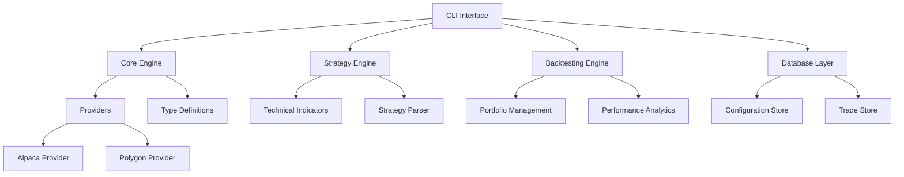

# Jware-Trader8 🚀

**Modular Automated Trading Platform with CLI Interface**

Jware-Trader8 is a next-generation automated trading platform designed with modularity, testability, and extensibility at its core. Built as a CLI-first tool, it supports crypto trading, strategy scripting, comprehensive backtesting, and secure configuration management.

## ✨ Key Features

- **🏗️ Modular Architecture**: Independent packages that can be used standalone or together
- **🔌 Provider Agnostic**: Easy switching between trading providers (Alpaca, Polygon, more coming)
- **📝 Strategy Scripting**: YAML-based strategy definitions with rich expression language
- **📊 Advanced Backtesting**: Detailed trade analysis with entry/exit points and performance metrics
- **🔐 Secure Configuration**: Encrypted API key storage with database management
- **⚡ CLI Interface**: Powerful command-line tools for all operations
- **🧪 Test-Driven**: Comprehensive test coverage with TDD approach

## 🚀 Quick Start

### Prerequisites
- Node.js ≥18.0.0
- npm ≥9.0.0

### Installation
```bash
# Clone the repository
git clone https://github.com/your-username/jware-trader8.git
cd jware-trader8

# Install dependencies and build
npm run setup

# Make CLI globally available
npm link packages/cli
```

### Configuration
```bash
# Set up your API keys
jtrader config set-keys --provider alpaca
jtrader config set-keys --provider polygon

# Verify configuration
jtrader config list
```

### Your First Backtest
```bash
# Run a simple moving average crossover strategy
jtrader backtest strategies/examples/sma_crossover.yaml \
  --symbol BTCUSD \
  --start 2023-01-01 \
  --end 2023-12-31 \
  --initial-capital 10000
```

### Start Paper Trading
```bash
# Start automated trading with a strategy
jtrader trade start strategies/examples/sma_crossover.yaml --dry-run

# Check trading status
jtrader status
```

## 📋 Documentation

| Document | Description |
|----------|-------------|
| [📋 **Specification**](docs/SPECIFICATION.md) | Complete technical specification and architecture |
| [🧠 **Pseudocode Modules**](docs/PSEUDOCODE_MODULES.md) | Detailed pseudocode for all modules |
| [📝 **Strategy Schemas**](docs/STRATEGY_SCHEMAS.md) | Strategy configuration guide and examples |
| [🏗️ **Project Structure**](docs/PROJECT_STRUCTURE.md) | Monorepo structure and development workflow |
| [🧪 **Implementation Guide**](docs/IMPLEMENTATION_GUIDE.md) | TDD approach and testing strategy |

## 🏛️ Architecture Overview



## 📦 Package Structure

The project is organized as a monorepo with independent packages:

```
packages/
├── types/           # TypeScript definitions and interfaces
├── core/            # Core trading engine and abstractions
├── providers/       # Trading and data provider implementations
├── strategies/      # Strategy engine with YAML parsing
├── backtesting/     # Backtesting engine with analytics
├── database/        # Data persistence and configuration
├── utils/           # Shared utilities and helpers
└── cli/             # Command-line interface
```

Each package can be used independently or as part of the complete trading platform.

## 🎯 Strategy Examples

### Simple Moving Average Crossover
```yaml
name: "SMA Crossover Strategy"
description: "Buy when fast SMA crosses above slow SMA"
version: "1.0.0"

parameters:
  symbol: "BTCUSD"
  timeframe: "1h"
  position_size: 0.10
  fast_period: 10
  slow_period: 30

indicators:
  - name: "sma_fast"
    type: "SMA"
    period: "{{ parameters.fast_period }}"
  - name: "sma_slow"
    type: "SMA"
    period: "{{ parameters.slow_period }}"

signals:
  buy:
    - condition: "sma_fast > sma_slow AND sma_fast[-1] <= sma_slow[-1]"
      action: "BUY"
  sell:
    - condition: "sma_fast < sma_slow AND sma_fast[-1] >= sma_slow[-1]"
      action: "SELL"
      size: "ALL"

risk_management:
  stop_loss: 0.02
  take_profit: 0.05
  max_positions: 1
```

### RSI Mean Reversion
```yaml
name: "RSI Mean Reversion"
description: "Buy oversold, sell overbought conditions"

parameters:
  symbol: "ETHUSD"
  position_size: 0.15
  rsi_period: 14
  oversold_level: 30
  overbought_level: 70

indicators:
  - name: "rsi"
    type: "RSI"
    period: "{{ parameters.rsi_period }}"

signals:
  buy:
    - condition: "rsi < {{ parameters.oversold_level }} AND rsi > rsi[-1]"
      action: "BUY"
  sell:
    - condition: "rsi > {{ parameters.overbought_level }}"
      action: "SELL"
      size: "ALL"
```

## 🔧 CLI Commands

### Trading Commands
```bash
# Start automated trading
jtrader trade start <strategy-file> [--dry-run] [--max-positions N]

# Stop all trading
jtrader trade stop

# Show trading status
jtrader status
```

### Backtesting Commands
```bash
# Run backtest
jtrader backtest <strategy-file> \
  --symbol <SYMBOL> \
  --start <YYYY-MM-DD> \
  --end <YYYY-MM-DD> \
  [--timeframe <1m|5m|1h|1d>] \
  [--initial-capital <AMOUNT>] \
  [--output <table|json|csv>]

# Example with full options
jtrader backtest strategies/my-strategy.yaml \
  --symbol BTCUSD \
  --start 2023-01-01 \
  --end 2023-12-31 \
  --timeframe 1h \
  --initial-capital 10000 \
  --output table
```

### Configuration Commands
```bash
# Set API keys (interactive)
jtrader config set-keys --provider <alpaca|polygon>

# Set configuration values
jtrader config set <key> <value>

# List all configurations
jtrader config list

# Get specific configuration
jtrader config get <key>
```

## 🧪 Development

### Setup Development Environment
```bash
# Install dependencies
npm install

# Build all packages
npm run build

# Run tests
npm run test

# Run in development mode (watch)
npm run dev
```

### Running Tests
```bash
# Run all tests
npm test

# Run tests with coverage
npm run test:coverage

# Run specific package tests
npm run test packages/core

# Run integration tests
npm run test:integration
```

### Adding a New Provider

1. Create provider implementation in [`packages/providers/src/your-provider/`](packages/providers/src/)
2. Implement [`ITradingProvider`](packages/core/interfaces/trading.ts) interface
3. Add provider to factory in [`packages/providers/src/factory.ts`](packages/providers/src/factory.ts)
4. Add comprehensive tests
5. Update documentation

### Creating Custom Strategies

1. Create YAML file in [`strategies/`](strategies/) directory
2. Define parameters, indicators, and signals
3. Validate with: `jtrader backtest your-strategy.yaml --validate`
4. Test with historical data
5. Deploy to live/paper trading

## 🔐 Security

- **API Key Encryption**: All API keys encrypted at rest using AES-256
- **Environment Isolation**: Separate configurations for development/production
- **Input Validation**: All user inputs validated and sanitized
- **Rate Limiting**: Built-in rate limiting for API calls
- **Audit Trail**: Complete logging of all trading activities

## 📊 Performance

- **Backtesting Speed**: Process 1M+ data points in <30 seconds
- **Memory Usage**: <500MB for typical backtests
- **Real-time Latency**: Order execution within 100ms of signal
- **Concurrent Trading**: Support for multiple simultaneous strategies

## 🤝 Contributing

We welcome contributions! Please see our [Contributing Guide](docs/CONTRIBUTING.md) for details.

### Development Process
1. Fork the repository
2. Create a feature branch (`git checkout -b feature/amazing-feature`)
3. Write tests for your changes
4. Implement your feature
5. Ensure all tests pass (`npm test`)
6. Commit your changes (`git commit -m 'Add amazing feature'`)
7. Push to the branch (`git push origin feature/amazing-feature`)
8. Open a Pull Request

## 📈 Roadmap

### Phase 1: MVP (Current)
- [x] Modular architecture design
- [x] Core trading interfaces
- [x] Alpaca & Polygon integration
- [x] YAML strategy scripting
- [x] Backtesting engine
- [x] CLI interface
- [ ] Comprehensive testing
- [ ] Documentation completion

### Phase 2: Enhanced Features
- [ ] Web UI for strategy management
- [ ] Additional providers (Interactive Brokers, Binance)
- [ ] Advanced charting integration
- [ ] Real-time notifications
- [ ] Cloud deployment options

### Phase 3: Advanced Trading
- [ ] Multi-asset portfolio management
- [ ] Options and derivatives support
- [ ] Advanced risk management
- [ ] Machine learning integration
- [ ] Social trading features

## 📄 License

This project is licensed under the MIT License - see the [LICENSE](LICENSE) file for details.

## 🙏 Acknowledgments

- Built with [TypeScript](https://www.typescriptlang.org/) for type safety
- [Lerna](https://lerna.js.org/) for monorepo management
- [Jest](https://jestjs.io/) for testing framework
- [Commander.js](https://github.com/tj/commander.js/) for CLI interface
- [Alpaca Markets](https://alpaca.markets/) for trading API
- [Polygon.io](https://polygon.io/) for market data

## 📞 Support

- **Documentation**: [docs/](docs/)
- **Issues**: [GitHub Issues](https://github.com/your-username/jware-trader8/issues)
- **Discussions**: [GitHub Discussions](https://github.com/your-username/jware-trader8/discussions)

---

**⚠️ Risk Disclaimer**: Trading involves risk of loss. Past performance does not guarantee future results. Only trade with money you can afford to lose. This software is provided for educational purposes and should not be considered as financial advice.

**Built with ❤️ for the trading community**
