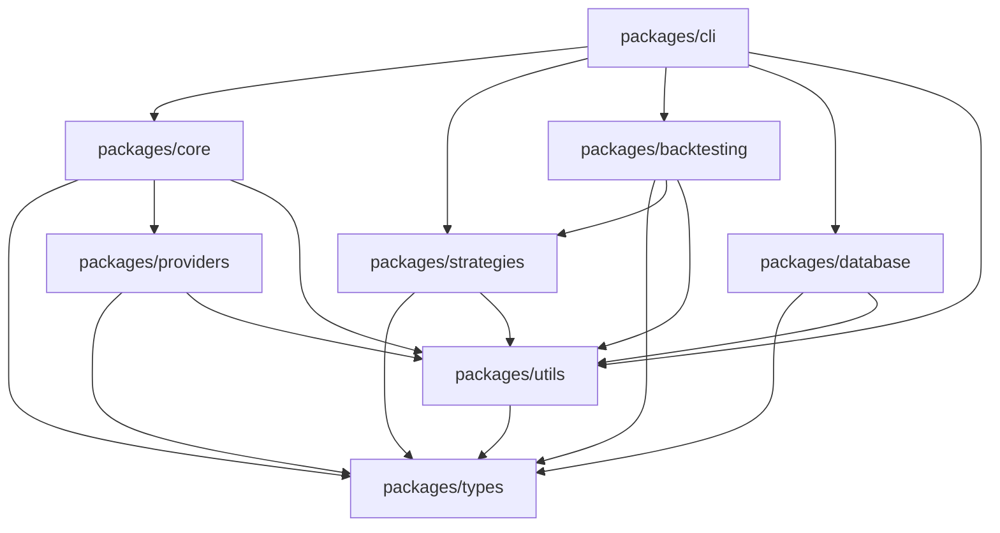

# Jware-Trader8 Project Structure & Development Workflow

## Project Directory Structure

```
jware-trader8/
├── README.md
├── package.json                    # Root package.json for monorepo
├── lerna.json                     # Lerna configuration for monorepo management
├── tsconfig.json                  # Root TypeScript configuration
├── .gitignore
├── .env.example                   # Example environment variables
├── docker-compose.yml             # Development environment setup
│
├── docs/                          # Documentation
│   ├── SPECIFICATION.md
│   ├── PSEUDOCODE_MODULES.md
│   ├── STRATEGY_SCHEMAS.md
│   ├── PROJECT_STRUCTURE.md
│   ├── API_REFERENCE.md
│   ├── USER_GUIDE.md
│   └── CONTRIBUTING.md
│
├── packages/                      # Modular packages
│   ├── types/                     # TypeScript definitions
│   │   ├── package.json
│   │   ├── src/
│   │   │   ├── index.ts
│   │   │   ├── trading.ts         # Trading interfaces
│   │   │   ├── strategy.ts        # Strategy interfaces
│   │   │   ├── data.ts           # Data structures
│   │   │   └── config.ts         # Configuration types
│   │   └── tests/
│   │
│   ├── core/                      # Core trading engine
│   │   ├── package.json
│   │   ├── src/
│   │   │   ├── index.ts
│   │   │   ├── interfaces/        # Core interfaces
│   │   │   ├── engine/           # Trading engine implementation
│   │   │   ├── factory/          # Provider factory
│   │   │   └── utils/            # Core utilities
│   │   └── tests/
│   │
│   ├── providers/                 # Trading & data providers
│   │   ├── package.json
│   │   ├── src/
│   │   │   ├── index.ts
│   │   │   ├── alpaca/           # Alpaca implementation
│   │   │   │   ├── trading-provider.ts
│   │   │   │   ├── websocket-client.ts
│   │   │   │   └── types.ts
│   │   │   ├── polygon/          # Polygon implementation
│   │   │   │   ├── data-provider.ts
│   │   │   │   ├── websocket-client.ts
│   │   │   │   └── types.ts
│   │   │   └── factory.ts        # Provider factory
│   │   └── tests/
│   │
│   ├── strategies/                # Strategy engine
│   │   ├── package.json
│   │   ├── src/
│   │   │   ├── index.ts
│   │   │   ├── engine/           # Strategy execution engine
│   │   │   ├── indicators/       # Technical indicators
│   │   │   ├── parser/          # YAML strategy parser
│   │   │   ├── validator/       # Strategy validation
│   │   │   └── evaluator/       # Condition evaluation
│   │   └── tests/
│   │
│   ├── backtesting/              # Backtesting engine
│   │   ├── package.json
│   │   ├── src/
│   │   │   ├── index.ts
│   │   │   ├── engine/          # Backtesting engine
│   │   │   ├── models/          # Portfolio, Trade models
│   │   │   ├── analytics/       # Performance analytics
│   │   │   └── reports/         # Report generation
│   │   └── tests/
│   │
│   ├── database/                 # Data persistence
│   │   ├── package.json
│   │   ├── src/
│   │   │   ├── index.ts
│   │   │   ├── stores/          # Data stores
│   │   │   ├── migrations/      # Database migrations
│   │   │   ├── models/          # Data models
│   │   │   └── encryption/      # Encryption utilities
│   │   └── tests/
│   │
│   ├── utils/                    # Shared utilities
│   │   ├── package.json
│   │   ├── src/
│   │   │   ├── index.ts
│   │   │   ├── logger.ts        # Logging utilities
│   │   │   ├── crypto.ts        # Cryptographic utilities
│   │   │   ├── math.ts          # Mathematical utilities
│   │   │   ├── time.ts          # Time utilities
│   │   │   └── validation.ts    # Validation utilities
│   │   └── tests/
│   │
│   └── cli/                      # Command-line interface
│       ├── package.json
│       ├── src/
│       │   ├── index.ts
│       │   ├── commands/        # CLI commands
│       │   │   ├── trade.ts
│       │   │   ├── backtest.ts
│       │   │   ├── config.ts
│       │   │   └── status.ts
│       │   ├── ui/             # CLI UI components
│       │   └── templates/      # Output templates
│       └── tests/
│
├── strategies/                   # Strategy definitions
│   ├── examples/                # Example strategies
│   │   ├── sma_crossover.yaml
│   │   ├── rsi_mean_reversion.yaml
│   │   ├── breakout_strategy.yaml
│   │   └── grid_trading.yaml
│   └── user/                   # User-defined strategies
│
├── data/                        # Data storage
│   ├── cache/                  # Data cache
│   ├── backtest-results/       # Backtesting results
│   └── logs/                   # Application logs
│
├── config/                      # Configuration files
│   ├── default.json           # Default configuration
│   ├── development.json       # Development environment
│   ├── production.json        # Production environment
│   └── test.json             # Test environment
│
└── scripts/                    # Development scripts
    ├── build.sh              # Build script
    ├── test.sh               # Test script
    ├── setup-dev.sh          # Development setup
    └── release.sh            # Release script
```

## Package Dependencies & Relationships

### Dependency Graph


### Package.json Files

#### Root [`package.json`](package.json)
```json
{
  "name": "jware-trader8",
  "version": "1.0.0",
  "description": "Modular automated trading platform",
  "private": true,
  "workspaces": [
    "packages/*"
  ],
  "scripts": {
    "build": "lerna run build",
    "test": "lerna run test",
    "lint": "lerna run lint",
    "clean": "lerna run clean",
    "dev": "lerna run dev --parallel",
    "cli": "node packages/cli/dist/index.js",
    "setup": "npm install && npm run build"
  },
  "devDependencies": {
    "@types/node": "^20.0.0",
    "@typescript-eslint/eslint-plugin": "^6.0.0",
    "@typescript-eslint/parser": "^6.0.0",
    "eslint": "^8.0.0",
    "jest": "^29.0.0",
    "lerna": "^7.0.0",
    "typescript": "^5.0.0"
  },
  "engines": {
    "node": ">=18.0.0",
    "npm": ">=9.0.0"
  }
}
```

#### CLI [`packages/cli/package.json`](packages/cli/package.json)
```json
{
  "name": "@jware-trader8/cli",
  "version": "1.0.0",
  "description": "Command-line interface for Jware-Trader8",
  "main": "dist/index.js",
  "bin": {
    "jtrader": "dist/index.js"
  },
  "scripts": {
    "build": "tsc",
    "dev": "tsc --watch",
    "test": "jest",
    "lint": "eslint src/**/*.ts"
  },
  "dependencies": {
    "@jware-trader8/core": "^1.0.0",
    "@jware-trader8/strategies": "^1.0.0",
    "@jware-trader8/backtesting": "^1.0.0",
    "@jware-trader8/database": "^1.0.0",
    "@jware-trader8/utils": "^1.0.0",
    "commander": "^11.0.0",
    "inquirer": "^9.0.0",
    "chalk": "^5.0.0",
    "cli-table3": "^0.6.0",
    "ora": "^7.0.0"
  }
}
```

## Development Workflow

### Phase 1: Foundation Setup (Week 1)

#### Day 1-2: Project Bootstrap
```bash
# Initialize project structure
mkdir jware-trader8 && cd jware-trader8
npm init -y
npm install -D lerna typescript @types/node

# Initialize lerna monorepo
npx lerna init

# Create package directories
mkdir -p packages/{types,core,providers,strategies,backtesting,database,utils,cli}

# Initialize each package
for pkg in types core providers strategies backtesting database utils cli; do
  cd packages/$pkg
  npm init -y
  mkdir -p src tests
  cd ../..
done
```

#### Day 3-4: TypeScript Setup
```bash
# Root tsconfig.json
cat > tsconfig.json << 'EOF'
{
  "compilerOptions": {
    "target": "ES2022",
    "module": "commonjs",
    "moduleResolution": "node",
    "declaration": true,
    "outDir": "./dist",
    "rootDir": "./src",
    "strict": true,
    "esModuleInterop": true,
    "skipLibCheck": true,
    "forceConsistentCasingInFileNames": true,
    "resolveJsonModule": true
  },
  "references": [
    { "path": "./packages/types" },
    { "path": "./packages/utils" },
    { "path": "./packages/core" },
    { "path": "./packages/providers" },
    { "path": "./packages/strategies" },
    { "path": "./packages/backtesting" },
    { "path": "./packages/database" },
    { "path": "./packages/cli" }
  ]
}
EOF

# Create package-specific tsconfig files
# Each package gets its own tsconfig.json with references
```

#### Day 5-7: Core Interfaces & Types
```typescript
// Start with packages/types - define all interfaces
// Then packages/utils - shared utilities
// Then packages/core - core trading interfaces
```

### Phase 2: Provider Integration (Week 2)

#### Day 1-3: Alpaca Trading Provider
```typescript
// Implement AlpacaTradingProvider
// Add connection, authentication, order management
// Unit tests with mocked API responses
```

#### Day 4-5: Polygon Data Provider
```typescript
// Implement PolygonDataProvider
// Add historical data fetching, real-time quotes
// Data caching and normalization
```

#### Day 6-7: Provider Factory & Testing
```typescript
// Create provider factory
// Integration tests with sandbox environments
// Error handling and retry logic
```

### Phase 3: Strategy Engine (Week 3)

#### Day 1-3: YAML Parser & Validator
```typescript
// Strategy configuration parser
// Schema validation
// Parameter templating system
```

#### Day 4-5: Technical Indicators
```typescript
// Implement core indicators (SMA, EMA, RSI, etc.)
// Indicator base classes and utilities
// Unit tests for accuracy
```

#### Day 6-7: Strategy Execution Engine
```typescript
// Condition evaluator
// Signal generation
// Strategy execution pipeline
```

### Phase 4: Backtesting Engine (Week 4)

#### Day 1-3: Portfolio Management
```typescript
// Portfolio model for backtesting
// Position tracking and P&L calculation
// Commission and slippage simulation
```

#### Day 4-5: Backtest Execution
```typescript
// Historical data processing
// Strategy execution simulation
// Performance metrics calculation
```

#### Day 6-7: Analytics & Reporting
```typescript
// Performance analytics
// Trade analysis
// Report generation
```

### Phase 5: Database & CLI (Week 5)

#### Day 1-3: Database Layer
```typescript
// SQLite setup and migrations
// Configuration storage with encryption
// Trade history storage
```

#### Day 4-5: CLI Commands
```typescript
// Trade command implementation
// Backtest command implementation
// Configuration commands
```

#### Day 6-7: CLI UI & Testing
```typescript
// CLI output formatting
// Interactive prompts
// End-to-end testing
```

### Phase 6: Integration & Polish (Week 6)

#### Day 1-3: Integration Testing
```bash
# Full workflow testing
# Paper trading validation
# Error handling improvements
```

#### Day 4-5: Documentation
```markdown
# User guide completion
# API reference generation
# Example strategies and tutorials
```

#### Day 6-7: Release Preparation
```bash
# Build automation
# Package publishing
# Version management
```

## Testing Strategy

### Unit Tests
```bash
# Each package has comprehensive unit tests
packages/*/tests/*.test.ts

# Test coverage requirements
- Core logic: 95%+ coverage
- Provider implementations: 90%+ coverage
- Strategy engine: 95%+ coverage
- CLI commands: 85%+ coverage
```

### Integration Tests
```bash
# Cross-package integration tests
tests/integration/

# Provider integration tests
tests/integration/providers/

# Strategy execution tests
tests/integration/strategies/

# Backtesting validation tests
tests/integration/backtesting/
```

### End-to-End Tests
```bash
# Full workflow tests
tests/e2e/

# CLI command tests
tests/e2e/cli/

# Paper trading tests
tests/e2e/trading/
```

## Build & Deployment

### Development Build
```bash
npm run build        # Build all packages
npm run test         # Run all tests
npm run lint         # Lint all packages
npm run dev          # Watch mode for development
```

### Production Build
```bash
npm run build:prod   # Production build with optimizations
npm run test:coverage # Test with coverage reports
npm run package      # Create distribution packages
```

### Docker Development Environment
```dockerfile
# docker-compose.yml
version: '3.8'
services:
  trader:
    build: .
    volumes:
      - .:/app
      - /app/node_modules
    environment:
      - NODE_ENV=development
    ports:
      - "3000:3000"
    
  redis:
    image: redis:7-alpine
    ports:
      - "6379:6379"
```

## Quality Gates

### Pre-commit Hooks
```bash
# .husky/pre-commit
#!/bin/sh
npm run lint
npm run test
npm run build
```

### Continuous Integration
```yaml
# .github/workflows/ci.yml
name: CI
on: [push, pull_request]
jobs:
  test:
    runs-on: ubuntu-latest
    steps:
      - uses: actions/checkout@v3
      - uses: actions/setup-node@v3
        with:
          node-version: '18'
      - run: npm ci
      - run: npm run build
      - run: npm run test
      - run: npm run lint
```

### Release Process
```bash
# Version bumping
npx lerna version --conventional-commits

# Publishing
npx lerna publish from-git

# Release notes generation
npx conventional-changelog -p angular -i CHANGELOG.md -s
```

This project structure provides:
1. **Modular Architecture** - Independent packages with clear boundaries
2. **Scalable Development** - Parallel development across packages
3. **Comprehensive Testing** - Unit, integration, and E2E tests
4. **Professional Tooling** - TypeScript, Lerna, Jest, ESLint
5. **CI/CD Ready** - Automated testing and deployment
6. **Documentation Focus** - Clear documentation at every level